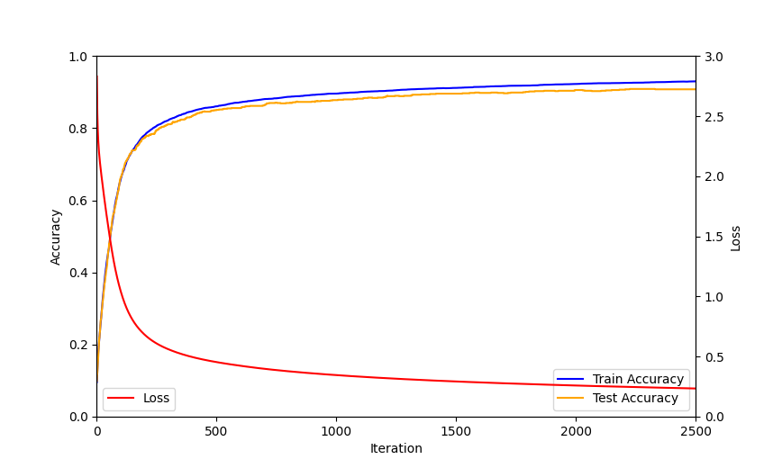

# Technical Documentation: Building a Neural Network from Scratch for MNIST

## Introduction

This project demonstrates how to build, train, and evaluate a simple feedforward neural network **from scratch using only NumPy**. The model is applied to the **MNIST dataset**, which contains images of handwritten digits (0–9). The goal is to classify each image into the correct digit.

Unlike high-level frameworks like TensorFlow or PyTorch, this implementation manually defines **forward propagation, backward propagation, weight updates, and evaluation metrics**. This not only trains a functioning neural network but also provides deep intuition about how neural networks actually learn.

---

## Data Preparation

1. **Dataset**: MNIST digits (28×28 grayscale images, flattened into 784 features).
2. **Preprocessing**:

   * Shuffled the dataset.
   * Split into **training (90%)** and **test (10%)** sets.
   * Normalized pixel values to `[0,1]` range for stability.
   * Converted labels into **one-hot encoding** for use in the loss function.

---

## Model Architecture

* **Input Layer**: 784 neurons (one for each pixel).
* **Hidden Layer**: 10 neurons, activation function **ReLU**.
* **Output Layer**: 10 neurons (for digits 0–9), activation function **Softmax**.

---

## Forward Propagation

1. **Hidden Layer**

   * Linear: `Z1 = W1 · X + b1`
   * Activation: `A1 = ReLU(Z1)`

2. **Output Layer**

   * Linear: `Z2 = W2 · A1 + b2`
   * Activation: `A2 = softmax(Z2)` → Produces probabilities across 10 digits.

---

## Loss Function

We use **Categorical Cross-Entropy Loss**:

$$
L = -\frac{1}{m}\sum_{i=1}^{m}\sum_{k=1}^{K} Y_k^{(i)} \cdot \log(A2_k^{(i)})
$$

* $Y$: one-hot encoded true labels.
* $A2$: predicted probabilities.
* The logarithm penalizes wrong confident predictions more strongly, encouraging the network to correct them.

---

## Backward Propagation

The gradients are derived as follows:

1. **Output Layer**:

   * `dZ2 = A2 - one_hot_Y`
   * `dW2 = (1/m) * dZ2 · A1^T`
   * `db2 = (1/m) * sum(dZ2)`

2. **Hidden Layer**:

   * `dZ1 = W2^T · dZ2 * ReLU'(Z1)`
   * `dW1 = (1/m) * dZ1 · X^T`
   * `db1 = (1/m) * sum(dZ1)`

---

## Weight Updates

Using **Gradient Descent**:

$$
W = W - \alpha dW, \quad b = b - \alpha db
$$

where $\alpha$ is the **learning rate** (set to 0.1).

---

## Training Process

* Ran for **2500 epochs**.
* At each epoch:

  * Forward propagation.
  * Backward propagation.
  * Update weights.
  * Record accuracy and loss.

---

## Results

The following graph shows the **training accuracy, test accuracy, and loss curve** over time:

* **Loss (red)** decreases steadily, confirming effective learning.
* **Training Accuracy (blue)** and **Test Accuracy (orange)** rise together.
* Final Test Accuracy: \~90%.

---

## Key Learnings

1. **Transposes are crucial**: Inputs and weights are shaped to ensure matrix multiplications align (features × samples convention).
2. **Why softmax + cross-entropy**: Softmax converts raw scores into probabilities, while cross-entropy emphasizes confident mistakes.
3. **ReLU in hidden layer**: Prevents saturation and speeds up learning compared to sigmoid.
4. **Loss vs Accuracy**: Accuracy shows performance, while loss shows *how confidently* the model is predicting.
5. **Visualization**: Live plotting provided real-time feedback, similar to professional training dashboards (e.g., TensorBoard).

---

## Conclusion

This project successfully demonstrated how to:

* Implement a neural network from scratch.
* Train it using forward/backward propagation.
* Visualize the training process with accuracy and loss curves.

By avoiding high-level frameworks, this implementation reinforced the mathematical foundations of deep learning and provided intuition about how models actually learn.

**Final Accuracy**: \~93% (Train), \~90% (Test)

---
